# YouTube播放器技术架构

## 系统架构图

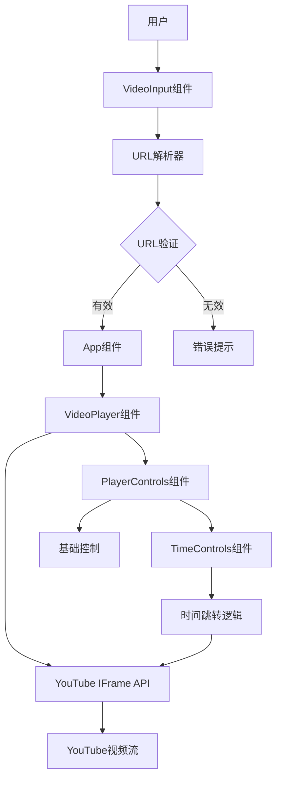

## 组件层级结构

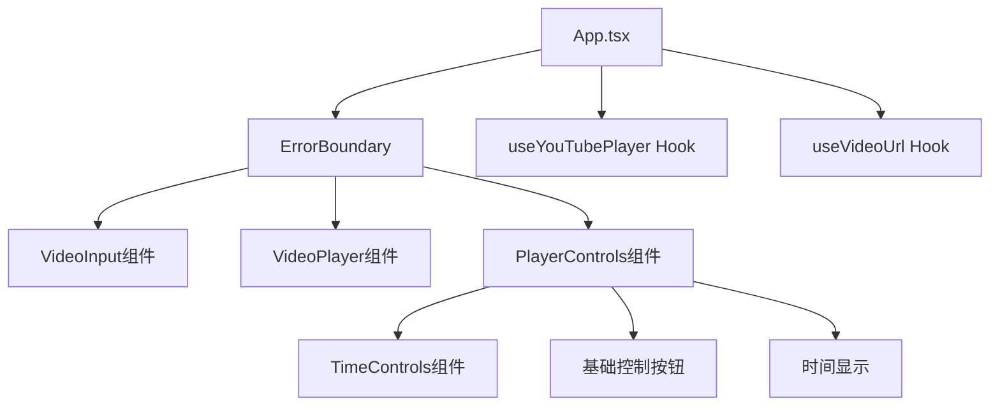

## 数据流图

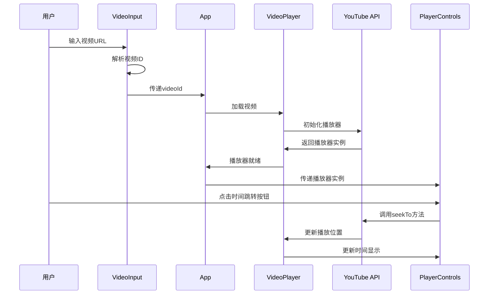

## 状态管理流程

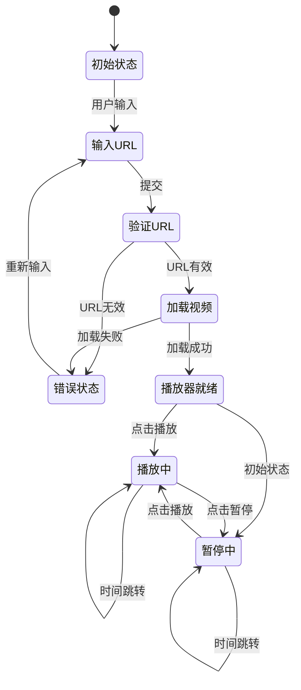

## 核心功能模块

### 1. URL处理模块
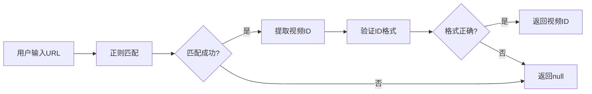

### 2. 时间跳转模块
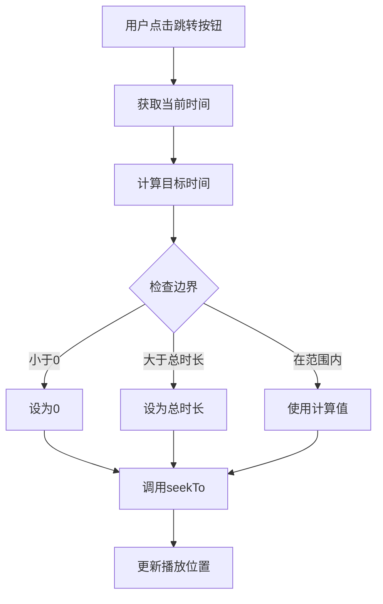

### 3. 播放器生命周期
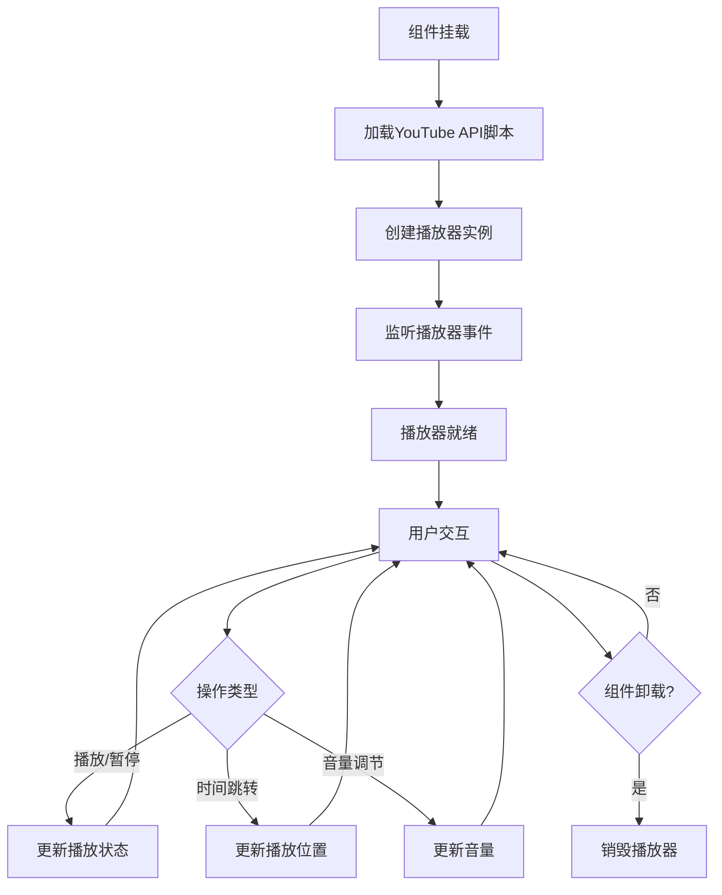

## 技术栈关系图

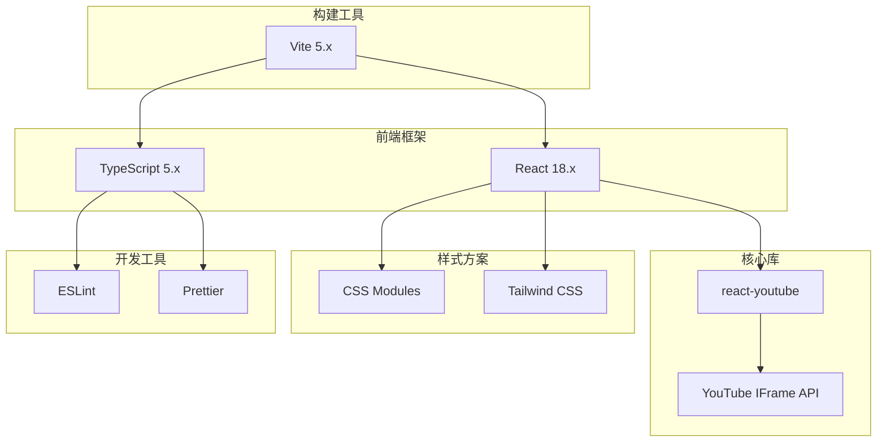

## 文件依赖关系

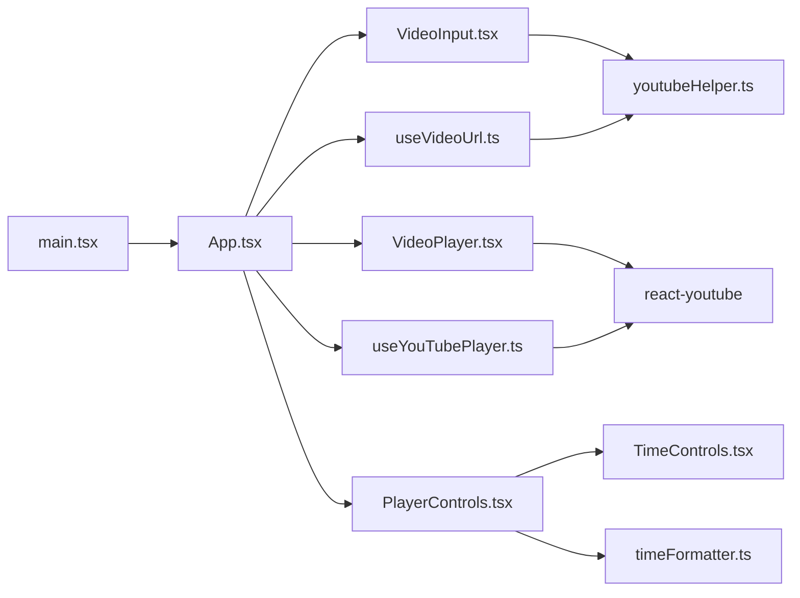

## 关键接口定义

### YouTube播放器接口
```typescript
interface YouTubePlayer {
  // 播放控制
  playVideo(): void;
  pauseVideo(): void;
  stopVideo(): void;
  
  // 时间控制
  seekTo(seconds: number, allowSeekAhead: boolean): void;
  getCurrentTime(): number;
  getDuration(): number;
  
  // 音量控制
  setVolume(volume: number): void;
  getVolume(): number;
  
  // 播放速度
  setPlaybackRate(rate: number): void;
  getPlaybackRate(): number;
  
  // 状态查询
  getPlayerState(): PlayerState;
}
```

### 组件Props接口
```typescript
// App状态
interface AppState {
  videoId: string | null;
  player: YouTubePlayer | null;
  isPlaying: boolean;
  currentTime: number;
  duration: number;
  error: string | null;
}

// VideoInput Props
interface VideoInputProps {
  onVideoIdChange: (videoId: string) => void;
  onError: (error: string) => void;
}

// VideoPlayer Props
interface VideoPlayerProps {
  videoId: string;
  onReady: (player: YouTubePlayer) => void;
  onStateChange: (state: PlayerState) => void;
  onError: (error: any) => void;
}

// PlayerControls Props
interface PlayerControlsProps {
  player: YouTubePlayer | null;
  isPlaying: boolean;
  currentTime: number;
  duration: number;
  onPlayPause: () => void;
}

// TimeControls Props
interface TimeControlsProps {
  onSeek: (seconds: number) => void;
  disabled: boolean;
}
```

## 性能优化策略

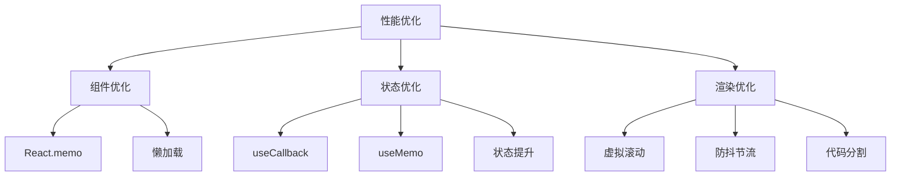

## 错误处理流程

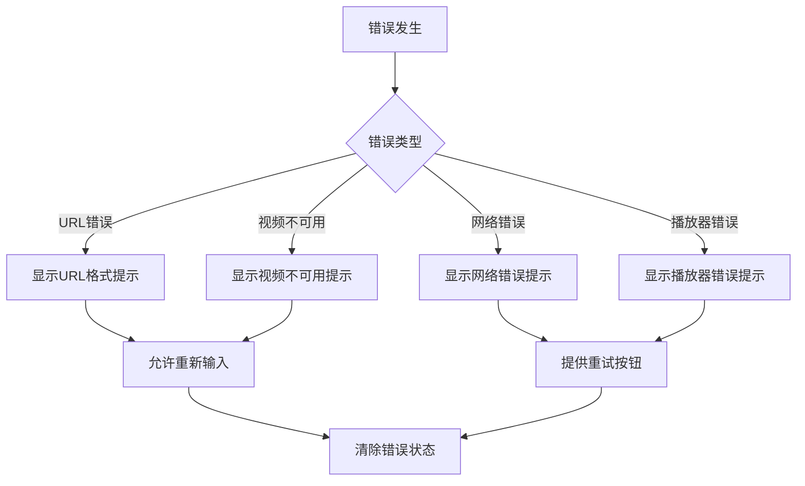

## 部署架构

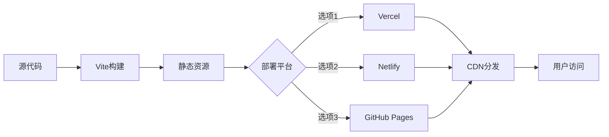

## 安全考虑

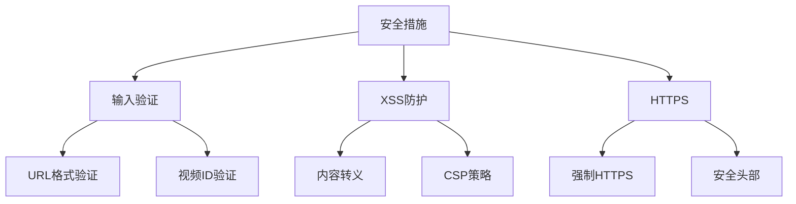

## 总结

该架构设计具有以下特点：

1. **模块化**: 组件职责清晰，易于维护
2. **可扩展**: 预留扩展接口，支持功能增强
3. **高性能**: 采用React最佳实践，优化渲染性能
4. **类型安全**: TypeScript提供完整的类型检查
5. **用户友好**: 完善的错误处理和状态反馈
